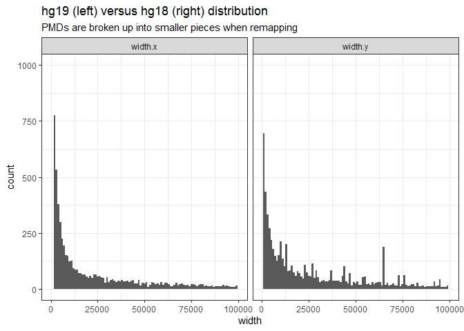

Outline

1. Get illumina provided cpg and genome locations
2. Use annotatr to provide 'basic' annotations, such as cpg island, gene elements, enhacners
3. Use published datasets to provide other interesting annotation info (e.g. imprinting)
4. Use rtracklayer::liftOver to map from build hg19 to build hg38 genome locations

# Libraries 


```r
library(rtracklayer) 
library(annotatr)
library(readxl)
library(fuzzyjoin)
library(janitor)
library(AnnotationHub)
library(tidyverse)
theme_set(theme_bw())

# load chain file
chain <- import.chain("hg19ToHg38.over.chain")
chain
```

```
## Chain of length 25
## names(25): chr22 chr21 chr19 chr20 chr18 chrY ... chr6 chr5 chr4 chr3 chr2 chr1
```

This initial creation step starts with the Illumina annotations and adds some basic UCSC information on genes and other genomic features. Because this step is very time-consuming to run (~10 hours), I usually do my updates at the beginning of [step 3. *Add other annotations*](#3).
 
# 1. Start with Illumina annotation

We start with the illumina provided locations of each probe. Note that Illumina has released multiple versions of the EPIC, each with a different set of probes (200-2000 probes can be different between arrays).

 Here I combine the b4 annotation with those probes that were removed from B2 to B3 versions. This set of probes
will be a starting point for cpgs to annotate.

TODO: Add in b2 and b1 annotations to ensure all EPIC probes in the universe will be covered.
TODO: Add in 450k probes?
TODO: Add in 27k probes?


```r
b4 <- read_csv('Z:/Victor/Data/DNAm annotations/MethylationEPIC_v-1-0_B4.csv', skip = 7)
b4_missing <- read_csv('Z:/Victor/Data/DNAm annotations/MethylationEPIC Missing Legacy CpG (v1.0_B3 vs. v1.0_B2) Annotations.csv')
anno <- bind_rows(b4, b4_missing %>% mutate_at(c('AddressA_ID', 'AddressB_ID'), as.character))

# clean up annotation
anno <- anno %>% mutate(Strand = ifelse(Strand == 'F', '+', '-'),
                start = MAPINFO,
                end = MAPINFO,
                chr = paste0('chr', CHR),
                cpg_id = Name) %>%
  
  # keep basic information
  dplyr::select(cpg_id, chr, start, end, Strand, AddressA_ID:Forward_Sequence) %>%
  
  # remove rs, and control probes
  filter(grepl('^[(cg)(ch)]{1}', cpg_id)) %>%
  
  # add illumina identifier
  rename_at(vars(-(1:5)), ~paste0('ilmn_', .))
```

# 2. Add UCSC annotations and FANTOM5 enhancers

Use annotatr to add UCSC annotations, and FANTOM5 enhancers

- gene related elements
- enhancers
- cpg island related elements

The gather and spread functions take 10 hours to complete.

First I filter to the illumina information to keep. 

Except for Start, End, chr and cpg_id columns, I rename others with the prefix 'ilmn', to indicate 
they are from the illumina annotation file. People can refer to the illumina files for description 
of those variables


```r
# coerce to granges
anno_GR <- makeGRangesFromDataFrame(anno, keep.extra.columns = T)

# select annotations to use
annots <- c('hg19_enhancers_fantom',
            'hg19_cpgs', 
            'hg19_genes_1to5kb',
            'hg19_genes_promoters', 
            'hg19_genes_5UTRs',
            'hg19_genes_exons',
            'hg19_genes_intronexonboundaries',
            'hg19_genes_introns',
            'hg19_genes_3UTRs',
            'hg19_genes_intergenic')
annots <- build_annotations(genome = 'hg19', annotations = annots)

# annotate the base annotation
annotated <- annotate_regions(regions = anno_GR, annotations = annots, ignore.strand = T) %>% 
  as_tibble

# clean it up
annotated
x1 <- length(unique(annotated$cpg_id))
x1 # 8866836 cpgs

system.time(
x <- annotated %>% 
  
  # 1. remove identifiers from annot.id, i.e "intron.9999" should be just called "intron"
  mutate(annot.id = str_extract(annot.id, '^[A-z0-9]+'),
         annot.type = str_extract(annot.type, '(?<=hg19_)[^_]+'),
         
         # Some transcripts are not associated with any gene symbol / entrez id
         # Because we are summarize all transcripts and all gene symbols into one line
         # If there is an NA in gene symbol then it will get skipped, 
         # so we will have n transcripts, and n-1 gene symbols
         # we need to replace thse withe something so we have n transcripts and n gene symbols
         annot.gene_id = if_else(!is.na(annot.tx_id) & is.na(annot.gene_id),
                                 'no_associated_gene', 
                                 annot.gene_id),
         annot.symbol = if_else(!is.na(annot.tx_id) & is.na(annot.symbol),
                                 'no_associated_gene', 
                                 annot.symbol)) %>%
  dplyr::select(-annot.seqnames, -annot.start, -annot.end, -annot.strand) %>%
  
  # 2. paste together all elements, grouped by cpg-related and gene-related elements
  ### I'm not sure but this step might be able to skip
  group_by(cpg_id,annot.type) %>%
  summarize(
    # paste(unique(.)) ensures all nonunique mappings are retained
    cpg = paste(unique(cpg_id)),
    chr = paste(unique(seqnames)),
    start = paste(unique(start)),
    end = paste(unique(end)),
    
    id = paste(annot.id, collapse = ", "),
    width = paste(annot.width, collapse = ", "),
    tx_id = paste(annot.tx_id, collapse = ", "),
    gene_id = paste(annot.gene_id, collapse = ", "),
    symbol = paste(annot.symbol, collapse = ", "))  %>%
  
  # 3. now spread multiple values across columns
  # first create a temporary variable to spread by, using gather() and unite()
  ungroup() %>%
  dplyr::select(-cpg_id)  %>%
  gather(variable, value, -(annot.type:end)) %>%
  unite(temp, annot.type, variable, sep = '_') %>%
  spread(temp, value) %>%
  
  # 4. clean up
  # remove uninformative columns
  dplyr::select(-enhancers_gene_id , -enhancers_symbol, -enhancers_tx_id, 
                -cpg_gene_id, -cpg_symbol, -cpg_tx_id) %>%
  
  # cpg_id == inter replace with "sea"
  mutate(cpg_id = ifelse(cpg_id == 'inter', 'sea', cpg_id)) %>%
  mutate_all(~replace(., . == 'NA', NA_character_))
) # takes 10 hours
# ensure the number of cpgs ended up with equals the number of unique cpgs starting out with
x1 == nrow(x) # must be T 

# now add back in the illumina columns
```

saveRDS(x, here::here('annotation.rds'))
write_csv(x, '../../data/main/processed/annotation.csv')

# Start here to skip 1. and 2. 

Set eval = TRUE and start here.


```r
x <- readRDS('annotation.rds')
```

# 3. PMDs

https://www.pnas.org/content/110/15/6037

Schroeder DI, Blair JD, Lott P, Yu HOK, Hong D, Crary F, et al. The human placenta methylome. PNAS. 2013 Apr 9;110(15):6037–42. 

PMD coordinates were actually in hg18 coordinates. So here I convert them to hg19/gr38 before replacing into the annotations

## hg18 -> hg19/gr38


```r
pmds <- read_xls('Z:/Victor/Projects/NIH - cells/data/external/placental_pmds.xls', 
                 col_names =  c('chr', 'start', 'end')) %>%
  
  # make an identifier for original pmds
  mutate(width = end-start,
         ID = paste0('pmd_', 1:n()))

# load chain file
chain_hg18_hg19 <- import.chain("hg18ToHg19.over.chain")
chain_hg18_hg19
```

```
## Chain of length 25
## names(25): chr22 chr21 chr19 chr20 chr18 chrY ... chr6 chr5 chr4 chr3 chr2 chr1
```

```r
# hg18 to hg19 coordinates
pmds_hg19 <- pmds %>%
  makeGRangesFromDataFrame(keep.extra.columns = T) %>%
  liftOver(chain_hg18_hg19) %>%
  unlist() %>%
  as_tibble() %>%
  select(-strand)

nrow(pmds_hg19) - nrow(pmds) # gains 4681 ranges
```

```
## [1] 4681
```

```r
setdiff(pmds$ID, pmds_hg19$ID) # lost 1 pmd
```

```
## [1] "pmd_4688"
```

```r
pmds_hg19 %>%
  as_tibble() %>%
  group_by(ID) %>%
  left_join(pmds, by = 'ID') %>%
  pivot_longer(cols = contains('width'),
               names_to = 'which',
               values_to = 'width') %>%
  ggplot() +
  geom_histogram(aes(x = width), binwidth = 1000) +
  scale_x_continuous(limits = c(0, 100000)) +
  scale_y_continuous(limits = c(0,1000)) +
  facet_wrap(~which) +
  labs(title = 'hg19 (left) versus hg18 (right) distribution', 
       subtitle = 'PMDs are broken up into smaller pieces when remapping')
```

```
## Warning: Removed 7696 rows containing non-finite values (stat_bin).
```

```
## Warning: Removed 5 rows containing missing values (geom_bar).
```

<!-- -->

These are the pmds that had some pieces broken up and some pieces mapped to more than one chromosome:


```r
check_other_chr <- function(x){
  x %>%
      
    # add in original hg18 coordinates
    left_join(pmds, by = 'ID') %>%
    select(ID, everything()) %>%
    
    # filter out those pmds pieces that were mapped to chromosomes that are not the original
    group_by(ID) %>%
    filter(n() > 1) %>% # pieces greater than 1
    summarize(n_chr = length(unique(seqnames)),
              chr_18 = first(chr),
              chr_new = paste0(unique(seqnames), collapse = ', ')) %>%
    filter(n_chr > 1) # pieces mapping to different chromosomes > 1; 15!
}

pmds_hg19 %>%
  check_other_chr
```

```
## # A tibble: 15 x 4
##    ID       n_chr chr_18 chr_new                             
##    <chr>    <int> <chr>  <chr>                               
##  1 pmd_1319     4 chr11  chr11, chr5, chr1, chrY             
##  2 pmd_1912     2 chr14  chr14, chr22                        
##  3 pmd_1913     2 chr14  chr14, chr22                        
##  4 pmd_4802     4 chr3   chr3, chr12, chr2, chr17            
##  5 pmd_5161     5 chr4   chr4, chr12, chr3, chr1, chr6       
##  6 pmd_5454     2 chr5   chr5, chr18                         
##  7 pmd_5975     2 chr6   chr6, chr2                          
##  8 pmd_6144     2 chr6   chr6, chr1                          
##  9 pmd_6145     3 chr7   chr16, chr3, chr11                  
## 10 pmd_6146     6 chr7   chr7, chr16, chr3, chr9, chr19, chr5
## 11 pmd_6354     2 chr7   chr7, chr15                         
## 12 pmd_6465     2 chr7   chr7, chr9                          
## 13 pmd_740      2 chr10  chr10, chrX                         
## 14 pmd_7557     3 chrX   chrX, chr1, chr8                    
## 15 pmd_7701     2 chrX   chrX, chr2
```

```r
pmds_hg19 %>%
  check_other_chr %>%
  pull(n_chr) %>%
  sum #15 pieces map to other chromosomes
```

```
## [1] 43
```

## Remove pieces that map to other chromosomes

The startegy is to remove these pieces


```r
pmds_hg19 <- pmds_hg19 %>%
  left_join(pmds %>% select(chr, ID), by = 'ID') %>%
  filter(seqnames == chr) %>% # keep only those pieces that match the original chromosome
  select(-chr, ID, everything())

# check that there are no more pieces mapping to other chromosomes
pmds_hg19 %>%
  check_other_chr
```

```
## # A tibble: 0 x 4
## # ... with 4 variables: ID <chr>, n_chr <int>, chr_18 <chr>, chr_new <chr>
```

Note that by lifting over, many of the pmds have been "broken" up. It seems that in hg19 many sequences were added into the genome. So a pmd is broken up when there is a new sequence added somewhere into the middle of it.

Should I take the remapped hg19 pmds as is?
Or should I say take the boundary for each original pmd in it's new coordinates, and merge broken pieces back together?

For now, I leave the remapped pmds as is.

Now, I've realized that some pmds have mapped to multiple chromosomes (because some sequences have been 
moved between genome builds). Also, some pmds share overlapping regions. 

## Merge overlapping regions


```r
pmds_hg19 <- pmds_hg19 %>% 
  rename(chr = seqnames) %>%
  arrange(chr, start) %>%
  group_by(chr) %>%
  
  # identify overlapping ranges
  mutate(previous_end = cummax(lag(end, default = 0)), # get the previous row's end or the cummax
         new_group = (start >= previous_end),
         group = cumsum(new_group))  %>%
  
  # merge overlapping regions
  group_by(chr, group) %>%
  summarize(start = min(start),
            end = max(end)) %>%
  
  mutate(pmd_width = end-start,
         pmd_id = paste0(chr, ':', start, '-', end))
```

## Add to annotation


```r
#hg19
anno <- x %>%
  
  mutate_at(c('start', 'end'), as.numeric) %>%
  genome_left_join(pmds_hg19, by = c('chr', 'start', 'end')) %>%
  rename(chr = chr.x, start = start.x, end = end.x) %>%
  dplyr::select(-contains('.y'))
```

```
## Warning: Column `chr` joining character vector and factor, coercing into
## character vector
```

```
## Warning: Factor `chr.y` contains implicit NA, consider using
## `forcats::fct_explicit_na`
```

# 4. Imprinting

List of imprinting regions extracted from Hanna et al. 2016, Court et al. 2014, Sanchez-Delgado et al. 2016, Hamada et al. 2016, Zink et al. 2018.

I describe the processing and merging of these regions @ github.com/wvictor/human_methylation_imprints


```r
imprint <- read_tsv('https://raw.githubusercontent.com/wvictor14/human_methylation_imprints/master/processed/all_imprinted_dmrs.tsv')
```

```
## Parsed with column specification:
## cols(
##   chr = col_double(),
##   start = col_double(),
##   end = col_double(),
##   methylated_allele = col_character(),
##   tissue_specificity = col_character(),
##   associated_gene = col_character(),
##   court = col_logical(),
##   hanna = col_logical(),
##   sanchez_delgado = col_logical(),
##   zink = col_logical(),
##   hamada = col_logical(),
##   note = col_character()
## )
```

```r
imprint <- imprint %>%
  
  # merge sources column
  mutate(court = if_else(court, 'Court 2014', NA_character_),
         hanna = if_else(hanna, 'Hanna 2016', NA_character_),
         sanchez_delgado = if_else(sanchez_delgado, 'Sanchez-Delgado 2016', NA_character_),
         hamada = if_else(hamada, 'Hamada 2016', NA_character_),
         zink = if_else(zink, 'Zink 2018', NA_character_)) %>%
  rowwise() %>%
  mutate(imprint_sources = paste0(na.omit(c(court, hanna, sanchez_delgado, zink, hamada)), 
                                  collapse = ', '),
         
         # other variables
         imprint_region = paste0(chr, ':', start, '-', end),
         chr = paste0('chr', chr)) %>%
  ungroup() %>%
  
  # rename
  select(chr, start, end, imprint_tissue_specificity = tissue_specificity,
         imprint_methylated_allele = methylated_allele,
         imprint_sources, imprint_region)

anno <- anno %>% 
  genome_left_join(imprint, by = c('chr', 'start', 'end')) %>%
  dplyr::rename(chr = chr.x, start = start.x, end = end.x) %>%
  select(-contains('.y'))
```

# 5. Map from hg19 to hg38

I provide a mapping from hg19 to hg38 coordinates. Note that this loses 247 cpgs.


```r
# coerce to granges object
anno_gr38 <- anno %>%
  makeGRangesFromDataFrame(keep.extra.columns = T)
seqlevelsStyle(anno_gr38) <- 'UCSC'

# hg19 to hg38 coordinates
anno_gr38 <- liftOver(anno_gr38, chain) %>% unlist

nrow(anno) - length(anno_gr38) # loses 247 loci
```

```
## [1] 247
```

```r
setdiff(anno$cpg, anno_gr38$cpg) # these specific loci
```

```
##   [1] "cg00003969"     "cg00004121"     "cg00224592"     "cg00340584"    
##   [5] "cg00428214"     "cg00543520"     "cg00684178"     "cg00705255"    
##   [9] "cg00727777"     "cg00841151"     "cg00863913"     "cg00896220"    
##  [13] "cg00977161"     "cg01036332"     "cg01225764"     "cg01238044"    
##  [17] "cg01288797"     "cg01449932"     "cg01500431"     "cg01505690"    
##  [21] "cg01557029"     "cg01744396"     "cg01842774"     "cg01849644"    
##  [25] "cg01944484"     "cg01957799"     "cg02019747"     "cg02087954"    
##  [29] "cg02099030"     "cg02202408"     "cg02361881"     "cg02494911"    
##  [33] "cg02532894"     "cg02829598"     "cg02953382"     "cg03032015"    
##  [37] "cg03054846"     "cg03071134"     "cg03291865"     "cg03313070"    
##  [41] "cg03329052"     "cg03455418"     "cg03598498"     "cg03631223"    
##  [45] "cg03639917"     "cg03827304"     "cg03885247"     "cg03887676"    
##  [49] "cg03937865"     "cg03979532"     "cg03982074"     "cg03987813"    
##  [53] "cg04092883"     "cg04234412"     "cg04260000"     "cg04330213"    
##  [57] "cg04501811"     "cg04779361"     "cg04793091"     "cg04824771"    
##  [61] "cg04859241"     "cg04926385"     "cg05010309"     "cg05055623"    
##  [65] "cg05140643"     "cg05207077"     "cg05380919"     "cg05663141"    
##  [69] "cg05711980"     "cg05712524"     "cg05802560"     "cg06180910"    
##  [73] "cg06677538"     "cg06720943"     "cg06807516"     "cg06815915"    
##  [77] "cg07090534"     "cg07148241"     "cg07154950"     "cg07229500"    
##  [81] "cg07293650"     "cg07316644"     "cg07368938"     "cg07502837"    
##  [85] "cg07587512"     "cg07636809"     "cg07646069"     "cg07750300"    
##  [89] "cg07778180"     "cg07784526"     "cg07827820"     "cg07829379"    
##  [93] "cg07855486"     "cg08219170"     "cg08251427"     "cg08276538"    
##  [97] "cg08470764"     "cg08534465"     "cg08643930"     "cg08735636"    
## [101] "cg08744519"     "cg08795713"     "cg09033563"     "cg09104747"    
## [105] "cg09255484"     "cg09279404"     "cg09313831"     "cg09334382"    
## [109] "cg09345949"     "cg10032306"     "cg10057085"     "cg10080807"    
## [113] "cg10150615"     "cg10269301"     "cg10280325"     "cg10476247"    
## [117] "cg10515465"     "cg10546252"     "cg10678937"     "cg10747483"    
## [121] "cg11000027"     "cg11141652"     "cg11142543"     "cg11244648"    
## [125] "cg11478607"     "cg11518408"     "cg11905131"     "cg12022450"    
## [129] "cg12051613"     "cg12228670"     "cg12261681"     "cg12356787"    
## [133] "cg12381370"     "cg12419862"     "cg12531767"     "cg12566536"    
## [137] "cg12615852"     "cg12622172"     "cg12689021"     "cg12689506"    
## [141] "cg12744907"     "cg12851526"     "cg12988231"     "cg13079840"    
## [145] "cg13151345"     "cg13208018"     "cg13219505"     "cg13276615"    
## [149] "cg13407149"     "cg13448596"     "cg13873802"     "cg13912721"    
## [153] "cg14174526"     "cg14265936"     "cg15125770"     "cg15174961"    
## [157] "cg15242686"     "cg15257568"     "cg15460135"     "cg15586842"    
## [161] "cg15844450"     "cg15853942"     "cg16385939"     "cg16435686"    
## [165] "cg16602091"     "cg16641538"     "cg16997375"     "cg17005068"    
## [169] "cg17043072"     "cg17175026"     "cg18045316"     "cg18100887"    
## [173] "cg18231760"     "cg18531269"     "cg18538332"     "cg18615537"    
## [177] "cg18772561"     "cg18915994"     "cg18948743"     "cg19130458"    
## [181] "cg19178389"     "cg19372327"     "cg19639919"     "cg19956866"    
## [185] "cg20007245"     "cg20038038"     "cg20064778"     "cg20238355"    
## [189] "cg20296141"     "cg20332060"     "cg20354141"     "cg20416139"    
## [193] "cg20688289"     "cg20727814"     "cg20804072"     "cg21166457"    
## [197] "cg21200085"     "cg21256200"     "cg21305475"     "cg21354059"    
## [201] "cg21898358"     "cg22224202"     "cg22666875"     "cg22833127"    
## [205] "cg22940546"     "cg23131131"     "cg23404902"     "cg23438516"    
## [209] "cg23671051"     "cg23997508"     "cg24034715"     "cg24163184"    
## [213] "cg24238852"     "cg24274354"     "cg24299149"     "cg24324738"    
## [217] "cg24330042"     "cg24370090"     "cg24550369"     "cg24565820"    
## [221] "cg24655570"     "cg24713076"     "cg24917131"     "cg25068310"    
## [225] "cg25133533"     "cg25428263"     "cg25703541"     "cg25741340"    
## [229] "cg25797164"     "cg25882538"     "cg25940606"     "cg26299763"    
## [233] "cg26330547"     "cg26387647"     "cg26580589"     "cg26588514"    
## [237] "cg26642960"     "cg26712673"     "cg26747299"     "cg26802830"    
## [241] "cg26835374"     "cg26940751"     "cg26946806"     "cg26988210"    
## [245] "cg27399747"     "cg27659796"     "ch.X.79027977R"
```

```r
# clean
anno_gr38 <- anno_gr38 %>% as_tibble %>%
  dplyr::rename(chr = seqnames) %>%
  select(cpg, everything())
```

# 6. Remove NAs in genes_ columns

There are some NAs in the `genes_symbol`, `genes_tx_id`, and `genes_gene_id` columns. I remove these in this section.


```r
anno <- anno %>% 
  mutate(genes_symbol = gsub(', \\bNA\\b', '', genes_symbol),
         genes_tx_id = gsub(', \\bNA\\b', '', genes_tx_id),
         genes_gene_id = gsub(', \\bNA\\b', '', genes_gene_id))

anno_gr38 <- anno_gr38 %>% 
  mutate(genes_symbol = gsub(', \\bNA\\b', '', genes_symbol),
         genes_tx_id = gsub(', \\bNA\\b', '', genes_tx_id),
         genes_gene_id = gsub(', \\bNA\\b', '', genes_gene_id))
```

# 7. Checks


```r
# Is there one row per cpg?
anno %>%
  group_by(cpg) %>%
  filter(n() > 1)
```

```
## # A tibble: 264 x 20
## # Groups:   cpg [132]
##    cpg   chr    start    end cpg_id cpg_width enhancers_id enhancers_width
##    <chr> <chr>  <dbl>  <dbl> <chr>  <chr>     <chr>        <chr>          
##  1 cg00~ chr4  1.55e8 1.55e8 island 1315      <NA>         <NA>           
##  2 cg00~ chr4  1.55e8 1.55e8 island 1315      <NA>         <NA>           
##  3 cg00~ chr4  1.55e8 1.55e8 shore  1246      enhancer     528            
##  4 cg00~ chr4  1.55e8 1.55e8 shore  1246      enhancer     528            
##  5 cg00~ chr7  2.43e7 2.43e7 island 1522      <NA>         <NA>           
##  6 cg00~ chr7  2.43e7 2.43e7 island 1522      <NA>         <NA>           
##  7 cg00~ chr2  2.29e8 2.29e8 shore  2000      <NA>         <NA>           
##  8 cg00~ chr2  2.29e8 2.29e8 shore  2000      <NA>         <NA>           
##  9 cg00~ chr4  1.55e8 1.55e8 shore  831       <NA>         <NA>           
## 10 cg00~ chr4  1.55e8 1.55e8 shore  831       <NA>         <NA>           
## # ... with 254 more rows, and 12 more variables: genes_gene_id <chr>,
## #   genes_id <chr>, genes_symbol <chr>, genes_tx_id <chr>, genes_width <chr>,
## #   group <int>, pmd_width <int>, pmd_id <chr>,
## #   imprint_tissue_specificity <chr>, imprint_methylated_allele <chr>,
## #   imprint_sources <chr>, imprint_region <chr>
```

```r
anno_gr38 %>%
  group_by(cpg) %>%
  filter(n() > 1)
```

```
## # A tibble: 264 x 22
## # Groups:   cpg [132]
##    cpg   chr    start    end width strand cpg_id cpg_width enhancers_id
##    <chr> <fct>  <int>  <int> <int> <fct>  <chr>  <chr>     <chr>       
##  1 cg00~ chr4  1.54e8 1.54e8     1 *      island 1315      <NA>        
##  2 cg00~ chr4  1.54e8 1.54e8     1 *      island 1315      <NA>        
##  3 cg00~ chr4  1.54e8 1.54e8     1 *      shore  1246      enhancer    
##  4 cg00~ chr4  1.54e8 1.54e8     1 *      shore  1246      enhancer    
##  5 cg00~ chr7  2.43e7 2.43e7     1 *      island 1522      <NA>        
##  6 cg00~ chr7  2.43e7 2.43e7     1 *      island 1522      <NA>        
##  7 cg00~ chr2  2.28e8 2.28e8     1 *      shore  2000      <NA>        
##  8 cg00~ chr2  2.28e8 2.28e8     1 *      shore  2000      <NA>        
##  9 cg00~ chr4  1.54e8 1.54e8     1 *      shore  831       <NA>        
## 10 cg00~ chr4  1.54e8 1.54e8     1 *      shore  831       <NA>        
## # ... with 254 more rows, and 13 more variables: enhancers_width <chr>,
## #   genes_gene_id <chr>, genes_id <chr>, genes_symbol <chr>, genes_tx_id <chr>,
## #   genes_width <chr>, group <int>, pmd_width <int>, pmd_id <chr>,
## #   imprint_tissue_specificity <chr>, imprint_methylated_allele <chr>,
## #   imprint_sources <chr>, imprint_region <chr>
```

# 8. Save data


```r
saveRDS(anno, file = 'hg19_epic_annotation.rds')
saveRDS(anno_gr38, file = 'hg38_epic_annotation.rds')
```

# Column descriptions


```r
## column descriptors
colnames(x)
```

```
##  [1] "cpg"             "chr"             "start"           "end"            
##  [5] "cpg_id"          "cpg_width"       "enhancers_id"    "enhancers_width"
##  [9] "genes_gene_id"   "genes_id"        "genes_symbol"    "genes_tx_id"    
## [13] "genes_width"
```

|column names|description|
|:---|:---|:---|
|cpg| cpg identifier|
|chr|chromosome position|
|start, end|cpg position in bp| 
|cpg_id|relation to cpg island features. uses UCSC cpg islands as reference, then definitions for shelves, shores, and seas are used|
|cpg_width|width in bp of the cpg island -related feature|
|enhancers_id|fantom5 enhancer|
|enhancers_width|width in bp of the fantom5 enhancer|
|genes_| columns are retrieved from txdb.hsapiens.ucsc.hg19.knowngene|
|genes_gene_id|Entrez ID|
|genes_id|gene-related elemtn, e.g. promoters, introns/exons, based off of UCSC|
|genes_symbol| Gene symbol.|
|genes_tx_id| transcript identifier|
|genes_width| width in bp of gene element|
|pmd_id, pmd_width| indicates which pmd a given cpg lies in. list taken from d.i.schoreder et al. 2013|
|imprinted_gene_| indicates the imprinted gene a given cpg lies in, placental or non-tissue specific|
|imprinted_dmr_| indicates the imprinted dmr a given cpg lies in, placental or non-tissue specific|
| | |
|imprinting regions/genes combined from several databases and primary articles, process by GDG.| |
|columns prefixed by 'ilmn_' come from the illumina provided annotation files| |


